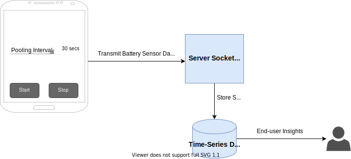

## CSC 4320 : Operating Systems
### Georgia State University - Spring 2021
### Alexandre Geraldo - 900 883 242
___
#### **Project 2 Proposal**
___
#### Topic: Battery Prophet App

+ ##### **Description**
    My project proposal is to develop an Android Application called Battery Prophet. The main goal of this application is to extend the battery sensor data to the next level where the end-user can visualize important insights provided by the battery sensor data. By collecting battery sensor data of an android device over time and send this collected data to a server via a socket communication, the user will be able to visualize the following insights:

    + Predict battery duration over time.
    + Monitor battery voltage over time. 
    + Visualize battery health.
    + Battery charge/discharge rate of change.

    By having access to these valuable insights, the end-user should also be able to answers the following questions:
    + When do I need to replace my cell phone's battery?
    + Is my cell's phone battery utilization higher/lower than X days before?
    + Is my power outlet charging my cell phone in a proper way (no overheating)?

+ ##### **OS concepts explored**

    The following OS concepts will be used in this implementation:

    + **Android App**
        + **Android OS package**
            + **BatteryManager:** The BatteryManager class provides a method for querying battery and charging properties.

        + **Android System Calls**
            + **Sockets:** Client socket system calls to transmit battery sensor data to a dedicated socket server.

            + **Threads:** Use of system threads to collect the battery sensor data over time.

    + **Backend**
        + **Sockets:** Server socket to receive battery sensor data from a android mobile device and store it into a time-series database.

+ ##### **Conceptual Model**
    

    + Once the end-user launches the app on the Android device, the app screen will be shown given to the end-user the option to define the battery data pooling interval, when to start and when to stop the  battery data pooling process.  

    + Once the battery data pooling process starts, a new thread will be created to collect battery sensor data,  establish a new socket connection to the server and transmit the data. The thread will sleep for the time specified by the end-user and repeat continuously until the end-user decides to stop the data collecting by clicking on the stop button. 

    + The server socket application will receive the data from the mobile application via a communication socket and store it in a time-series database. 

    + The end-user will be accessing a web-based portal to visualize the insights provided by data collection. 

    
